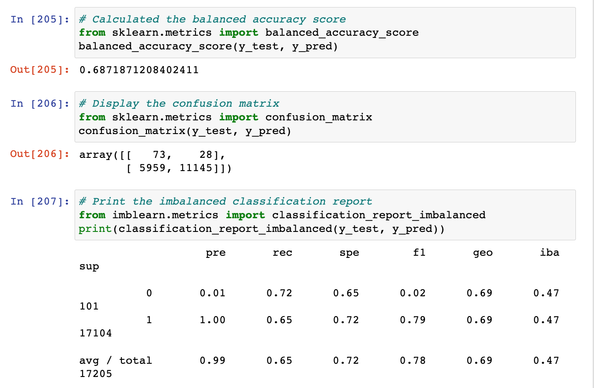
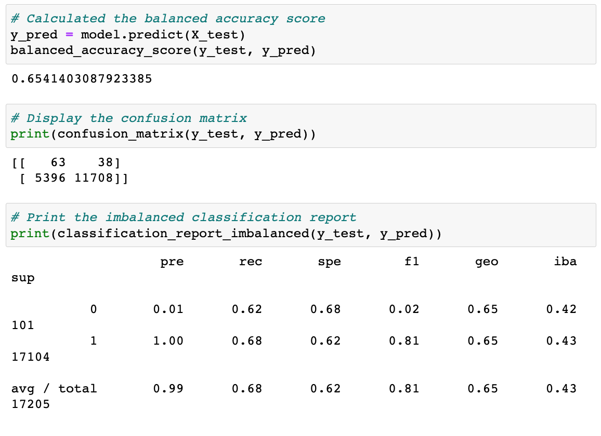
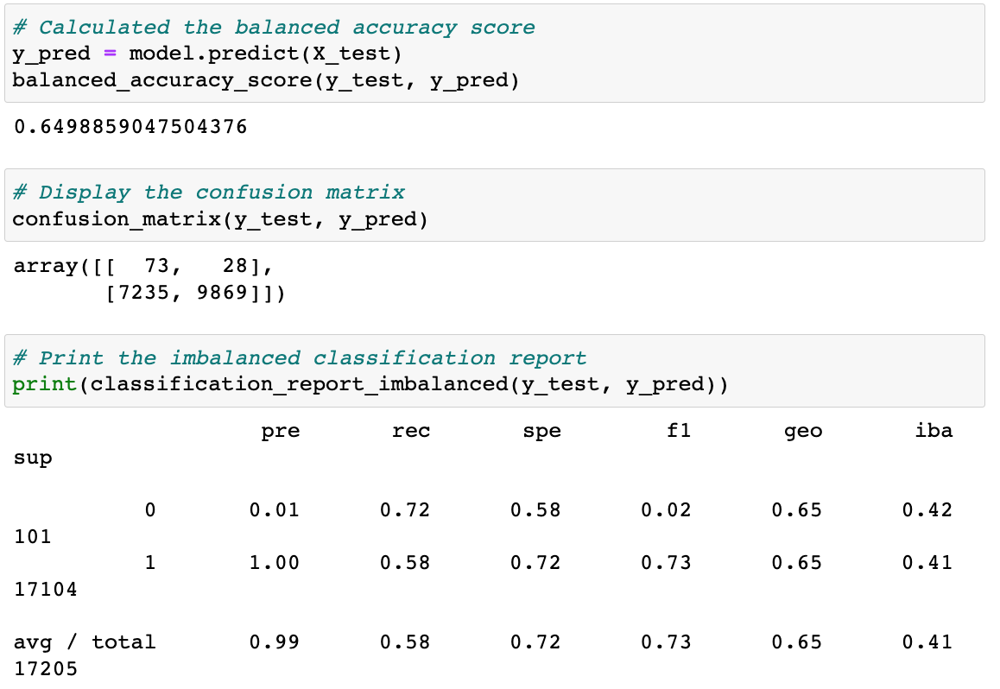
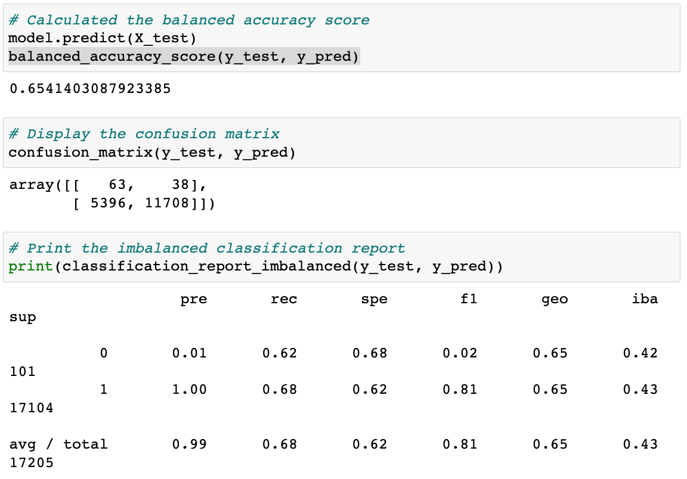
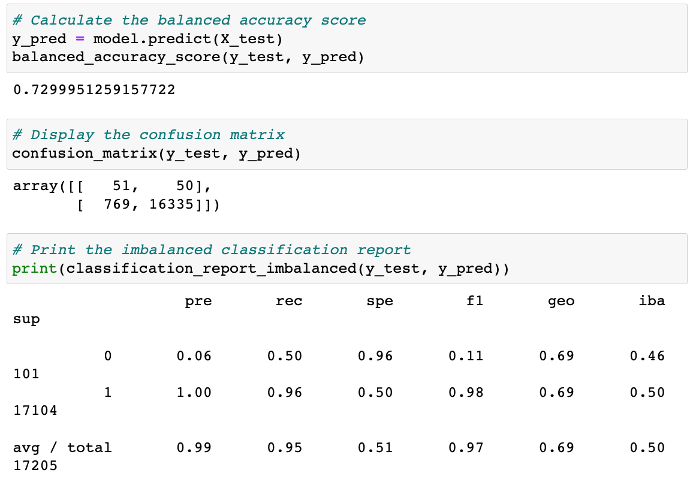
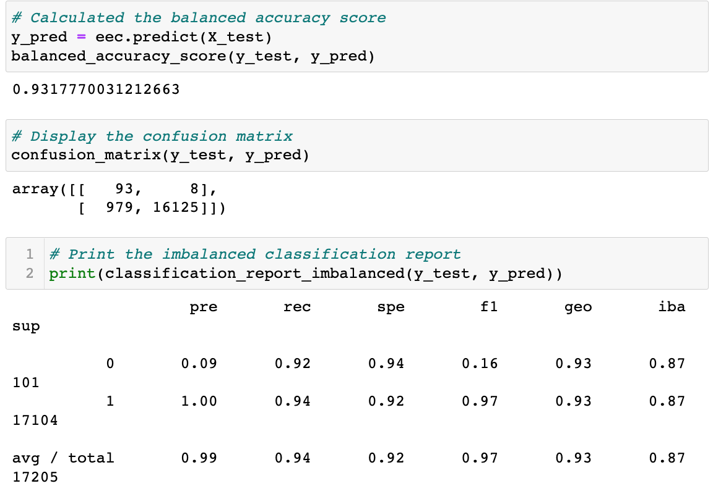

# Credit Risk Analysis

## Overview: 
The purpose of this project is to build and evaluate several classification models for credit risk assessment. Credit risk is an inherently unbalanced classification problem, as good loans outnumber risky loans. Therefore, we will employ different techniques to train and evaluate models on unbalanced datasets such as oversampling and undersampling.

## Results: 

### Naive Random Oversampling

The fist approach was to utilize RandomOverSampler before running LogisticRegression. The balanced accuracy score for this approach is 69% which is not very high. But also, we can see that our precision for class 0 is 0.01 which means that our of all the loans predicted to default only 1% defaulted. At the same time, the recall is 0.72, meaning that we we only able to identify 72% of loans which will deafult. Such low precision rate tells us that the model if overfitting. It's classifying a large number of loans as "high risk" while only 1 % of those loans will default. 

### SMOTE Oversampling

The second approach was to utilize SMOTE overampler instead of RandomOverSampler. Our precision remained the same and recall rate went down to 0.62 meaning the model missed even more (38%) of high-risk loans.

### SMOTEENN Over- & Under-sampling

Next we have tried SMOTEENN approach which combines over- and under-sampling using SMOTE and Edited Nearest Neighbours. Our precision remained at the same level (0.01) and the recall rate went back up to 0.72.

### Undersampling

Using undersampling only resulted in the same precision rate and the recall rate went down to 0.62 again.

### Balanced Random Forest Classifier

Next we tried a Random Forest Classifier. Our precision went up to 0.06 meaning that 6% of all the loans identified as "high-risk" would indeed deafault. Thought this is a slight improvement it's still incredibly low. The recall rate went down to 0.5 meaning the algorithm is not catching 50% of high-risk loans.

### Easy Ensemble Classifier

Lastly, we tried Easy Ensemple Classifier. With this approach, our precison rate went up to 0.09 and the recall rate went up to 0.92. This means that we are catching 92% of high-risk loans, which is pretty good. At the same time, we are still flagging too many loans as high-risk while only 9% of them would default.

## Summary: 
Based on the results of various approaches we have utilized it is clear that LogisticRegression is not the best model for the task at hand. The model has performed poorly regardless of the approach taken to balance the dataset (random simple ovesampling, SMOTE oversampling, undersampling, or combined over/under sampling approach SMOTEENN). Logistic Regression consistenly resulted in overfitting and flagging way too many loans as high-risk. Only 1% of those loans would actually default. 

Random Forest Classifier did not produce significantly better results. While the precision went up a bit, the recall rate has dropped to 0.05.

Out of all approaches we have tried, Easy Ensemble Classsifier was most successful with 0.93 accuracy score and recall rate or 0.92. However, the precision rate remained very low at 0.09. While this algorithm caught 92% of high-risk loans, it also flagged a large number of low-risk loans as high-risk. Whether this is a suitable model would depend on how the resulting information would be used. If the goal is to identify high-risk loan owners so the bank can send out information about available assistance, then it might be OK to use this model, as we would be capturing 92% of impacted population and sending information to additional loan owners who are not at risk of defaulting would not pose any harm. If however, the information would be used for making decisions about credit-worthiness of the loan owners that would further be relied on for loan apporval process then this is not a suitable model as it would result in negative impact on 99% of targeted population who were classified incorrectly.